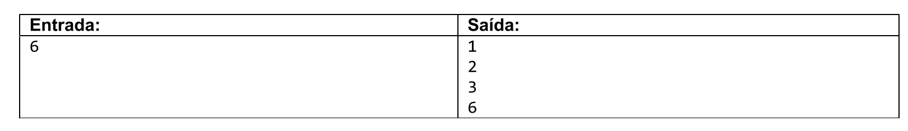

# Exercise Text

## English
Read an integer $n$ and calculate all its $divisors$.

---

## Portuguese (Br)
Ler um número inteiro $n$ e calcular todos os seus $divisores$.

---

## Spanish
Leer un entero $n$ y calcular todos sus $divisores$.

### Example

