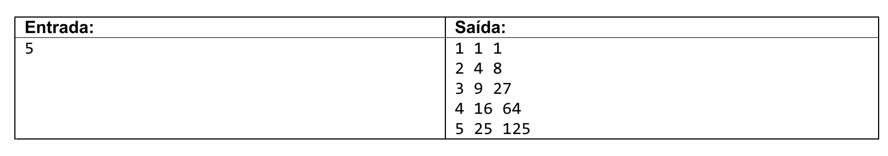

# Exercise Text

## English

Write a program to read a ***positive integer*** number $n$. The program should then display $n$ lines on the screen, starting from 1 to $n$.

For each line, display the ***line number***, then the ***square*** and ***cube*** of the value, as shown in the example.

---

## Portuguese (Br)

Fazer um programa para ler um número ***inteiro positivo*** $n$. O programa deve então mostrar na tela $n$ linhas, começando de 1 até $n$.

Para cada linha, mostrar o ***número da linha***, depois o ***quadrado*** e o ***cubo*** do valor, conforme exemplo.

---

## Spanish

Haga un programa para leer un número entero positivo $n$. A continuación, el programa debería mostrar $n$ líneas en la pantalla, empezando desde 1 hasta $n$.

Para cada línea, muestre el ***número de línea***, luego el ***cuadrado*** y el ***cubo*** del valor, como se muestra en el ejemplo.

---

---

### Example

