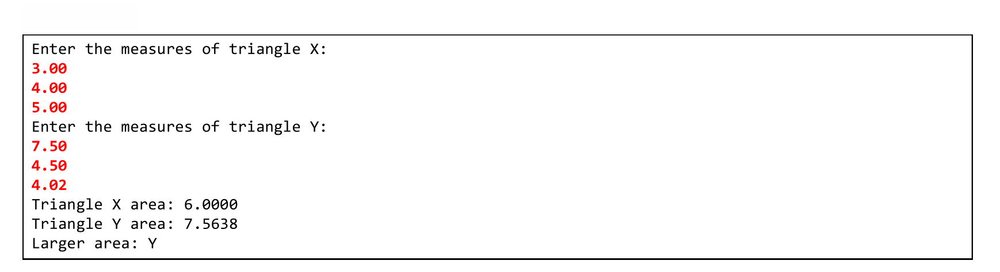
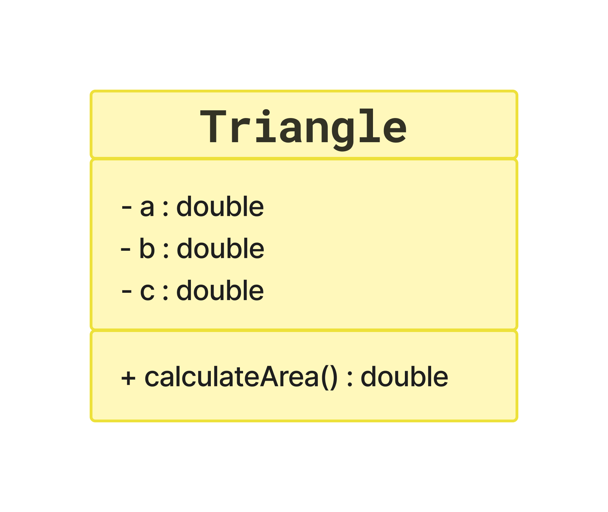

# Exercise Text

## English

Write a program to read the measures of the sides of ***two*** triangles $X$ and $Y$ (assume valid measures).

Then, ***show the value of the areas*** of the two triangles and ***say which of the two triangles has the larger area***.

The formula for calculating the $area$ of a triangle from the measures of its sides $a$, $b$ and $c$ is as follows ($\textit{Heron's}$ formula):

$$ \textit{area} = \sqrt{p(p-a)(p-b)(p-c)} $$

> where $p = \frac{a + b + c}{2}$

---

---

## Portuguese (Br)

Fazer um programa para ler as medidas dos lados de ***dois*** triângulos $X$ e $Y$ (suponha medidas válidas). 

Em seguida, ***mostrar o valor das áreas*** dos dois triângulos e ***dizer qual dos dois triângulos possui a maior área***.

A fórmula para calcular a $área$ de um triângulo a partir das medidas de seus lados $a$, $b$ e $c$ é a seguinte (fórmula de $\textit{Heron}$):

$$ \textit{area} = \sqrt{p(p-a)(p-b)(p-c)} $$

> onde $p = \frac{a + b + c}{2}$

---

---

## Spanish

Escriba un programa para leer las medidas de los lados de ***dos*** triángulos $X$ e $Y$ (asumir medidas válidas).

Luego, ***muestra el valor de las áreas*** de los dos triángulos y ***di cuál de los dos triángulos tiene el mayor área***.

La fórmula para calcular el $área$ de un triángulo a partir de las medidas de sus lados $a$, $b$ y $c$ es la siguiente (fórmula de $\textit{Heron}$):

$$ \textit{área} = \sqrt{p(p-a)(p-b)(p-c)} $$

> donde $p = \frac{a + b + c}{2}$

---

---

### Example

---

---

### UML Diagram

