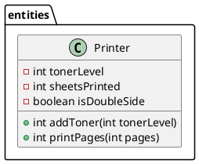

# 🖨️ Java Inheritance Exercise: Printer Class

Welcome to this hands-on Java exercise designed to strengthen your understanding of **classes**, **encapsulation**, and pave the way for learning **inheritance** in Java!

In this exercise, you’ll interact with a `Printer` class that simulates the behavior of a real-world printer — complete with toner levels, sheets tracking, and double-sided printing logic.

---

## 📚 Objective

Your task is to **create the base Printer class** and then **extend the existing Printer functionality** using inheritance. You will do it using the base class UML Diagram, practicing object-oriented programming concepts including:

- **Class** creation
- **Constructor** use
- **Encapsulation** (getters/setters)
- **Inheritance** and **method overriding**
- **Error handling** and **user input**

---

## 🧠 What You’re Working With

### Provided Class Diagram

- `Printer`: A base class that handles:
  - Toner level management
  - Sheets printed tracker
  - Page printing logic (with optional double-sided support)

### Main.java

- A sample entry point to test your `Printer` logic through user input.

---

## 🛠️ Your Assignment
### 1. Create the base Class: `Printer`
Create the base class using the provided Class Diagram:

📌 UML (PlantUML syntax)



> If you're viewing this on GitHub, you can render it using a plugin like:
>> - **PlantUML for VS Code**
>> - **LiveUML**
>> - **Markdown Preview Enhanced (for Atom or VS Code)**
>> - Or use [PlantUML Online Server](https://www.plantuml.com/plantuml/) to preview the diagram. 
>> - In **Intellij**, usually it is disabled by default, you can enable it [using this steps](https://stackoverflow.com/questions/54413962/cant-render-component-diagram-with-plantuml-in-intellij).


### 2. 🔧 Create a New Class: `ColorPrinter`

You’ll use inheritance to reuse the base functionality and method overloading to support color-specific features.

- Extend the existing `Printer` class.
- Add a new private field: `int colorTonerLevel`.
- Implement a **new overloaded method**:

```java
public void addToner(int blackToner, int colorToner);
```

- In this method:
  - Cap both toner levels at 100.
  - Print a message for both toner levels after adding.

### 2. 🧪 Add More Functionality

- Add a method `printColorPages(int pages)` in `ColorPrinter`:
  - Decrease both toner levels proportionally (e.g., 1 unit per 2 pages).
  - Reuse logic from `Printer.printPages()` for calculating sheets.

### 3. 📥 Modify `Main.java`

- Replace the existing `Printer` object with your `ColorPrinter`.
- Prompt the user whether to print in **color** or **black & white**.
- Show the final toner levels and sheets printed.

---

## ✅ Example Output

```bash
Enter the number of pages to print: 7
Print in color? (yes/no): yes
Printing pages...
Sheets printed: 4
Color toner level: 92
Black & white toner level: 90
```

---

## 📁 File Structure

```bash
src/
├── entities/
│   ├── Printer.java
│   └── ColorPrinter.java   <-- Your task!
├── Main.java
```

---

## 🧼 Notes

- Be sure to validate user input where appropriate.
- Consider edge cases like negative pages or excessive toner amounts.

---

## 🎓 Learning Goals

By completing this assignment, you will:
- Understand how to extend a class in Java.
- Practice method overriding and constructor chaining.
- Strengthen your grasp on encapsulation and input handling.


